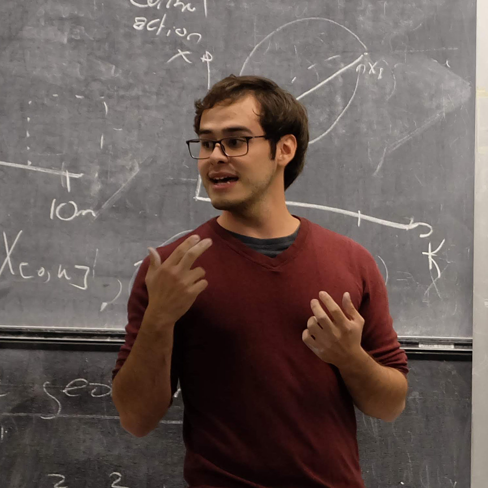

::: {.hero-section}
:::: {.columns}

::: {.column style="width:30%;"}

<picture>
  <source srcset="images/profile.webp" type="image/webp">
  
</picture>

Juan Diego Cardenas Cartagena

Researcher & ML Engineer Trustworthy AI for safety-critical systems

  <a class="hero-social-btn" href="https://github.com/dccartagena" target="_blank" rel="noopener" aria-label="GitHub">
    <i class="bi bi-github"></i>
  </a>
  <a class="hero-social-btn" href="https://www.linkedin.com/in/dccartagena" target="_blank" rel="noopener" aria-label="LinkedIn">
    <i class="bi bi-linkedin"></i>
  </a>
  <a class="hero-social-btn" href="https://scholar.google.com/citations?user=kvdSZLEAAAAJ" target="_blank" rel="noopener" aria-label="Google Scholar">
    <i class="bi bi-mortarboard-fill"></i>
  </a>
  <a class="hero-social-btn" href="https://orcid.org/0000-0001-9718-6929" target="_blank" rel="noopener" aria-label="ORCID">
    <i class="bi bi-person-badge-fill"></i>
  </a>

:::

::: {.column style="width:70%; padding-left:2.5rem;"}

<h1 class="hero-title">J.D. Cardenas Cartagena</h1>

::: {.hero-welcome}
I am a researcher and engineer at the intersection of applied mathematics, control theory, and machine learning. My work focuses on designing **trustworthy AI agents** for safety-critical mechatronics systems — building techniques that are high-performing, provably safe, and interpretable.

I recently joined [Youwe Concept B.V.](https://youwe.nl) in The Netherlands as a Machine Learning Engineer, and I am finalizing my Ph.D. at the University of Agder, Norway. Previously I was a Lecturer in Artificial Intelligence at the University of Groningen, where I received the **Teacher of the Year Award for AI & CCS** in 2025.

Outside academia I enjoy analyzing geopolitics and finance, and I support education outreach initiatives to engage young people in science and research.
:::

## Research Interests

  Safe Reinforcement Learning
  Data-Driven Control
  Trustworthy AI
  Formal Verification
  Autonomous Systems

Constrained and risk-aware policy optimization · adaptive learning-based control for dynamical systems · interpretability, robustness, and formal verification of autonomous systems.

## Selected Publications

  

    
2025

    
TMLR

    
Safe Reinforcement Learning with Chance-Constrained Model Predictive Control

    
J.D. Cardenas-Cartagena et al.

    <a class="pub-card-link" href="publications.html">View →</a>
  

  

    
2025

    
NLDL

    
Interpretable Neural Lyapunov Functions for Safety-Critical Control

    
J.D. Cardenas-Cartagena et al.

    <a class="pub-card-link" href="publications.html">View →</a>
  

  

    
2024

    
ICAART

    
Risk-Aware Adaptive Control for Uncertain Dynamical Systems

    
J.D. Cardenas-Cartagena et al.

    <a class="pub-card-link" href="publications.html">View →</a>
  

<a href="publications.html" class="btn btn-outline-primary btn-sm">View all publications</a>

## Teaching & Mentoring

At the University of Groningen I taught and co-designed undergraduate and graduate courses in Signals & Systems, Reinforcement Learning, and Machine Learning. I have mentored Bachelor's and Master's thesis students in applying rigorous AI methodologies to real-world engineering problems.

Outside academia I participate in science outreach and education initiatives aimed at engaging young people in science and research — particularly through programs in Colombia such as [Clubes de Ciencia Colombia](https://clubesdeciencia.co) and [Parque Explora](https://www.parqueexplora.org).

:::
::::
:::

---

## News {#news}

