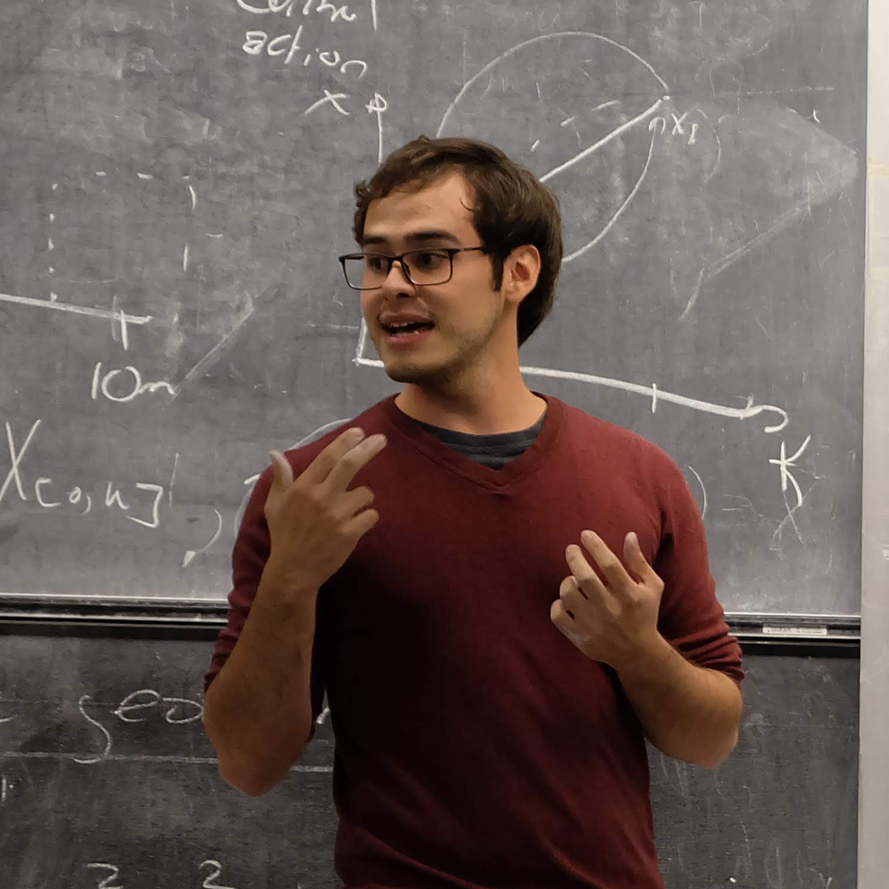

```{=html}
<section class="hero">
  <div class="hero-inner">

    <div class="hero-copy">
      <p class="hero-eyebrow">Machine Learning &middot; Applied Mathematics &middot; Mechatronics</p>
      <h1 class="hero-headline">
        Trustworthy AI for<br><span class="hero-accent">safety-critical systems</span>
      </h1>
      <p class="hero-lede">
        I'm <strong>Juan Diego Cardenas Cartagena</strong> — a machine learning engineer and
        researcher designing AI agents that are high-performing, provably safe, and interpretable,
        grounded in control theory and applied mathematics.
      </p>
      <div class="hero-cta">
        <a class="hero-btn hero-btn-primary" href="publications.html">View Publications</a>
        <a class="hero-btn hero-btn-ghost" href="cv.html">Curriculum Vitae</a>
      </div>
      <div class="hero-social">
        <a class="hero-social-btn" href="https://github.com/dccartagena" target="_blank" rel="noopener" aria-label="GitHub">
          <i class="bi bi-github"></i>
        </a>
        <a class="hero-social-btn" href="https://www.linkedin.com/in/dccartagena" target="_blank" rel="noopener" aria-label="LinkedIn">
          <i class="bi bi-linkedin"></i>
        </a>
        <a class="hero-social-btn" href="https://scholar.google.com/citations?user=kvdSZLEAAAAJ" target="_blank" rel="noopener" aria-label="Google Scholar">
          <i class="bi bi-mortarboard-fill"></i>
        </a>
        <a class="hero-social-btn" href="https://orcid.org/0000-0001-9718-6929" target="_blank" rel="noopener" aria-label="ORCID">
          <i class="bi bi-person-badge-fill"></i>
        </a>
      </div>
    </div>

    <div class="hero-portrait">
      <div class="hero-portrait-frame">
        <picture>
          <source srcset="images/profile.webp" type="image/webp">
          
        </picture>
      </div>
      <span class="hero-chip hero-chip-1">Safe RL</span>
      <span class="hero-chip hero-chip-2">Data-Driven Control</span>
      <span class="hero-chip hero-chip-3">Autonomous Systems</span>
    </div>

  </div>

  <div class="hero-meta">
    <div class="hero-meta-item">
      <span class="hero-meta-label">Now</span>
      ML Engineer at <a href="https://youwe.nl" target="_blank" rel="noopener">Youwe Concept B.V.</a>, The&nbsp;Netherlands
    </div>
    <div class="hero-meta-item">
      <span class="hero-meta-label">Ph.D.</span>
      Finalizing at the University of Agder, Norway
    </div>
    <div class="hero-meta-item">
      <span class="hero-meta-label">Award</span>
      Teacher of the Year 2025, AI &amp; CCS, University of Groningen
    </div>
  </div>

  <a class="hero-scroll-cue" href="#about" aria-label="Scroll to about section">
    <i class="bi bi-chevron-down"></i>
  </a>
</section>
```

## About {#about}

::: {.about-text}
I am a researcher and engineer at the intersection of applied mathematics, control theory, and machine learning. My work focuses on designing **trustworthy AI agents** for safety-critical mechatronics systems — building techniques that are high-performing, provably safe, and interpretable.

I recently joined [Youwe Concept B.V.](https://youwe.nl) in The Netherlands as a Machine Learning Engineer, and I am finalizing my Ph.D. at the University of Agder, Norway. Previously I was a Lecturer in Artificial Intelligence at the University of Groningen, where I received the **Teacher of the Year Award for AI & CCS** in 2025.

Outside academia I enjoy analyzing geopolitics and finance, and I support education outreach initiatives to engage young people in science and research.
:::

## Research Interests

```{=html}
<div class="research-tags">
  <span class="research-tag">Safe Reinforcement Learning</span>
  <span class="research-tag">Data-Driven Control</span>
  <span class="research-tag">Trustworthy AI</span>
  <span class="research-tag">Autonomous Systems</span>
</div>
```

## News {#news}


